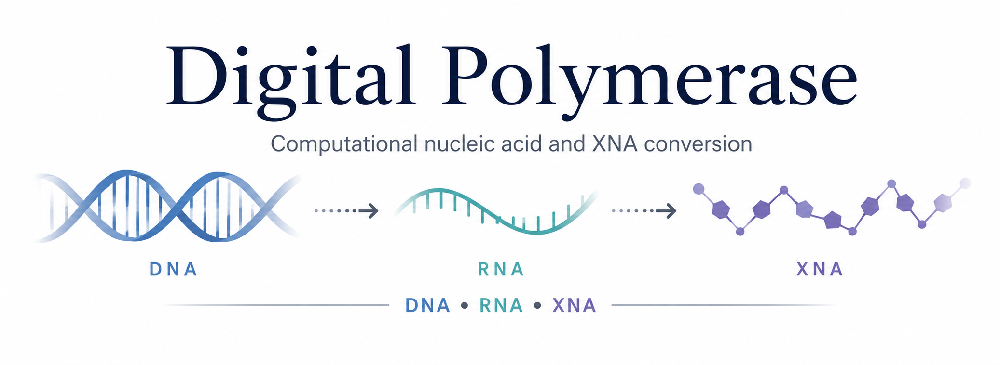

<p align="center">
  
</p>

# Digital Polymerase

**Digital Polymerase** is an early-stage dry-lab software project for exploring computational conversion and reconstruction between canonical nucleic acids (**DNA** and **RNA**) and xeno/synthetic nucleic acids (**XNA**) such as **HNA, ANA, FANA, CeNA, XyNA, TNA, GNA, and PNA**.

The project focuses on **structure-guided nucleic acid transformation**, especially using **PDB structures as input and output**. Rather than treating conversion as a simple atom-replacement problem, Digital Polymerase develops **template-guided**, **chain-aware**, **linkage-aware**, **scaffold-aware**, and **polymer-aware** approaches for rebuilding candidate nucleic acid structures across different backbone chemistries.

All generated structures should be interpreted as **computational candidate models**, not experimentally validated molecules. They require downstream geometry inspection, stereochemical review, energy minimization, molecular dynamics simulation, force-field/topology assessment, and expert chemical evaluation.

---

## Current Snapshot

Digital Polymerase currently has:

- reusable `core/` modules for atoms, residues, PDB I/O, geometry, template handling, target registry, validation, reporting, and custom errors
- prototype RNA → XNA candidate generators for **HNA, ANA, FANA, CeNA, XyNA, TNA, GNA, and PNA**
- benchmark folders containing inputs, templates, outputs, reports, screenshots, and failure notes
- a first stable-candidate RNA → FANA converter with Python API and CLI
- a FANA Level 4 readiness gate for explicit connectivity, C2′ stereochemistry,
  template-relative sugar pucker, termini, and parameterization handoff
- a candidate-bound external FANA parameter gate that validates hashes,
  provenance, residue/terminal mappings, declared parameter coverage, and review
  evidence before preparing—never executing—Amber minimization inputs
- core smoke tests and FANA regression tests at 8, 34, and 111 nt

The project is currently transitioning from:

```text
one-off prototype scripts
```

toward:

```text
shared core engine → stable converters → regression suite → physical-readiness gates → external-parameter gates
```

---

## Vision

Digital Polymerase is part of the broader **XNA World Project**, a dry-lab framework for exploring alternative genetic polymers and their relevance to the functional thresholds of life.

Wet-lab xenobiology investigates whether XNA molecules can be synthesized, copied, evolved, and made functional. Digital Polymerase focuses on the complementary **in silico side**: building tools that help researchers model, transform, compare, and stress-test nucleic acid systems across natural and synthetic chemistries.

In this broader vision, Digital Polymerase serves as the **conversion and reconstruction engine**.

---

## Project Philosophy

Digital Polymerase does not assume that nucleic acid conversion is a one-step operation.

A conversion may occur at different levels:

1. **Symbolic conversion**  
   Rewriting a sequence or residue representation from one nucleic acid type to another.

2. **Topological conversion**  
   Reassigning residue identity, backbone atoms, linkage patterns, and polymer architecture.

3. **Geometric reconstruction**  
   Rebuilding a candidate 3D structure using structural templates, local alignment, chain-preserving transformations, linkage remapping, scaffold tiling, or coordinate reconstruction.

4. **Physically refined modeling**  
   Evaluating and refining the candidate structure through molecular mechanics, energy minimization, molecular dynamics, force-field/topology preparation, and other validation workflows.

The main converter focus remains **Level 3: geometric candidate
reconstruction**. FANA now also has **Level 4 readiness and external-parameter
gates**, which audit topology and require external parameter provenance before
preparing Amber inputs. They do not claim that the candidate is physically
refined or MD-ready.

A key lesson from the early prototypes is:

> A converter is not successful just because it writes a PDB. It must preserve polymer logic, validate its own geometry, and report its limitations.

A second major lesson from the PNA prototypes is:

> Not every XNA should be treated as “RNA with a modified sugar.” Some XNAs require chemistry-first scaffold strategies rather than fold-preserving conversion.

---

## Scope

This repository is intended as a **dry-lab computational tool**, not as a replacement for experimental validation.

Its long-term purpose is to help researchers explore possible structural scenarios in which functional XNA molecules may exist, interact, or be compared with canonical nucleic acids.

Digital Polymerase is especially intended for exploratory work in:

- xenobiology
- synthetic biology
- computational structural biology
- nucleic acid engineering
- alternative genetic polymers
- origins-of-life and astrobiology-inspired molecular systems

---

## Quick Start

Install locally:

```bash
pip install -e .
```

Run smoke tests:

```bash
pytest
```

After generating a FANA candidate, run its physical-readiness gate:

```bash
digital-polymerase-fana-readiness \
  --candidate candidate_fana.pdb \
  --template fana_template.pdb \
  --report fana_readiness.md \
  --manifest fana_readiness.json \
  --conect-output candidate_fana_conect.pdb \
  --strict
```

Then initialize the candidate-bound external-parameter template:

```bash
digital-polymerase-fana-parameters init \
  --candidate candidate_fana.pdb \
  --readiness fana_readiness.json \
  --output fana_parameters.json
```

See [`docs/fana_level4_readiness.md`](docs/fana_level4_readiness.md) for geometry
status semantics and
[`docs/fana_external_parameter_gate.md`](docs/fana_external_parameter_gate.md)
for the external Amber/modXNA handoff. The repository does not include FANA
force-field parameter files.

The current package is still early-stage. Most conversion scripts remain in:

```text
src/digital_polymerase/prototypes/
```

The `converters/` directory is reserved for future stable wrappers.

---

## Repository Structure

Current major structure:

```text
digital-polymerase/
├── README.md
├── LICENSE
├── pyproject.toml
├── requirements.txt
├── assets/
│   ├── digital_polymerase_banner.png
│   ├── digital_polymerase_banner__v2.png
│   └── digital_polymerase_banner_v3.png
│
├── src/
│   └── digital_polymerase/
│       ├── __init__.py
│       ├── core/
│       │   ├── README.md
│       │   ├── __init__.py
│       │   ├── atoms.py
│       │   ├── residues.py
│       │   ├── pdb_io.py
│       │   ├── geometry.py
│       │   ├── templates.py
│       │   ├── registry.py
│       │   ├── validation.py
│       │   ├── reporting.py
│       │   └── errors.py
│       │
│       ├── converters/
│       │   ├── README.md
│       │   └── rna_to_fana.py
│       │
│       ├── physical/
│       │   ├── fana.py
│       │   └── fana_parameters.py
│       │
│       └── prototypes/
│           ├── rna_to_hna_template_based.py
│           ├── rna_to_hna_template_guided.py
│           ├── rna_to_ana_fragment_guided_002A2.py
│           ├── rna_to_fana_fragment_guided.py
│           ├── rna_to_cena_template_guided.py
│           ├── rna_to_xyna_fragment_guided.py
│           ├── rna_to_tna_linkage_optimized.py
│           ├── rna_to_gna_linkage_optimized.py
│           └── failed/
│               ├── ana/
│               └── pna/
│
├── docs/
│   ├── core_package.md
│   ├── fana_level4_readiness.md
│   ├── fana_external_parameter_gate.md
│   ├── prompt_protocol.md
│   ├── prototype_001_rna_to_hna.md
│   ├── prototype_001B_rna_to_hna_template_guided.md
│   ├── prototype_002A_rna_to_ana_fragment_guided.md
│   ├── prototype_003A_run_summary.md
│   ├── prototype_004A_rna_to_cena_template_guided.md
│   ├── prototype_005A_rna_to_xyna_fragment_guided.md
│   ├── prototype_006B_rna_to_tna_linkage_optimized.md
│   └── prototype_007A_rna_to_gna_linkage_optimized.md
│
├── examples/
│   └── rna_to_hna_8mer/
│
├── benchmarks/
│   ├── hh_ribozyme_8t5o/
│   ├── hna_template_regression/
│   ├── ana_fragment_scaling/
│   ├── fana_fragment_scaling/
│   ├── cena_scaling/
│   ├── xyna_scaling/
│   ├── tna_scaling/
│   ├── gna_scaling/
│   └── pna_scaling/
│
└── tests/
    ├── test_core_smoke.py
    ├── test_rna_to_fana.py
    ├── test_fana_physical_readiness.py
    └── test_fana_parameter_gate.py
```

---

## Core Engine

The `core/` package contains reusable building blocks shared by prototypes and future stable converter modules.

| Module | Purpose |
|---|---|
| `atoms.py` | `Atom` dataclass, element inference, atom cloning |
| `residues.py` | Base identity, glycosidic atom, sequence extraction, base/backbone splitting |
| `pdb_io.py` | Simple PDB parser and writer |
| `geometry.py` | Kabsch alignment, RMSD, distance, angle, dihedral, coordinate transforms |
| `templates.py` | Template indexing and base-class donor selection |
| `registry.py` | XNA target grammar and validation defaults |
| `validation.py` | Chain/linkage/base-attachment/local geometry validation |
| `reporting.py` | Markdown and JSON report helpers |
| `errors.py` | Custom exceptions |

The core is not a converter by itself. It provides reusable parts. Converters should define the reconstruction strategy.

---

## Conversion Strategy Classes

The prototypes have revealed that Digital Polymerase needs multiple conversion paradigms rather than one universal algorithm.

| Strategy class | Description | Example prototypes |
|---|---|---|
| **Full-template-guided reconstruction** | Use a target XNA template as the primary scaffold and transplant sequence/base identity | `001B` |
| **Chain-preserving reconstruction** | Preserve RNA chain continuity first, then introduce target local scaffold geometry | `001C.1`, `002A.2`, `003A` |
| **Template-guided scaffold reconstruction** | Use target scaffold geometry as a donor while retaining source sequence identity | `004A`, `005A` |
| **Linkage-remapped reconstruction** | Replace canonical RNA linkage assumptions with target-XNA-specific linkage grammar | `006B.4`, `007A` |
| **Template-primary scaffold-first reconstruction** | Preserve/tile target scaffold first, then map base identity | `008B` |
| **Sequence-primary generation** | Generate a target XNA sequence carrier from sequence, FASTA, or RNA-derived sequence | `008C` |
| **Hybrid-guided boundary testing** | Combine RNA spatial information with target-XNA local chemistry under movement limits | `008D` |

This distinction is one of the main conceptual outputs of the project so far.

---

## Current Prototype Families

Digital Polymerase currently contains multiple RNA → XNA candidate-generation prototype families. These are **prototype candidate generators**, not stable production converters.

| Prototype | Conversion | Main method | Current status |
|---|---|---|---|
| `001B` | RNA → HNA | Full-template-guided short-mer reconstruction | Successful 8-mer candidate |
| `001C.1` | RNA → HNA | Chain-preserving scalable HNA-like reconstruction with base-attachment correction | Successful scaling to 111 nt |
| `002A.2` | RNA → ANA | Chain-preserving fragment-guided reconstruction | Successful candidate generation up to 111 nt |
| `003A` | RNA → FANA | Chain-preserving reconstruction with FANA C2′/F2′ local geometry | Successful candidate generation up to 111 nt |
| `004A` | RNA → CeNA | Template-guided cyclohexenyl-scaffold reconstruction | Successful candidate generation up to 111 nt |
| `005A` | RNA → XyNA | Pentose-like template-guided reconstruction | Successful candidate generation up to 111 nt |
| `006B.4` | RNA → TNA | Linkage-remapped threose-scaffold reconstruction | Successful candidate generation up to 111 nt |
| `007A` | RNA → GNA | Linkage-optimized glycerol-scaffold reconstruction | Successful first-pass candidate generation up to 111 nt |
| `008A.1` | RNA → PNA | RNA-fold-forced pseudopeptide reconstruction | Failed/tangled; archived as productive failure |
| `008B` | RNA → PNA | Template-primary PNA scaffold-first base replacement | Successful sequence-preserving PNA candidate generation |
| `008C` | Sequence/RNA/FASTA → PNA | Sequence-primary PNA generator | Useful sequence-carrier generator; not fold-preserving |
| `008D` | RNA → PNA | RNA-informed hybrid-guided PNA reconstruction | Boundary/partial result; fold-preserving PNA remains unsolved |

---

## Prototype Notes

### HNA

The HNA family began as the first RNA → XNA proof of concept, then evolved into scalable chain-preserving reconstruction.

Current benchmark result:

```text
HNA-like candidate generation scales from 8 nt to 111 nt.
```

---

### ANA

The ANA prototype revealed a critical failure mode:

```text
low local RMSD ≠ valid polymer chain
```

Patch `002A.2` introduced a chain-preserving strategy:

```text
preserve chain continuity first
introduce ANA-like local geometry second
validate explicitly
```

Current status:

```text
RNA → ANA chain-preserving candidate generation works visually and computationally up to the 111-mer benchmark.
```

---

### FANA

Prototype `003A` applies chain-preserving logic with FANA-specific C2′/F2′ local geometry.

Current status:

```text
RNA → FANA candidate generation works from 8 nt to 111 nt.
```

Prototype `003A` has now been promoted to the first stable-candidate converter,
with a reusable Python API, CLI, standardized reports, JSON validation metrics,
and regression tests at 8, 34, and 111 nt.

FANA also has the project's first Level 4 readiness gate. It constructs an
explicit covalent graph, audits covalent distances and C2′ stereochemistry,
compares sugar pucker against the experimental FANA template, writes optional
`CONECT` records, and emits a parameterization handoff manifest. A passing gate
reports `PARAMETERIZATION_REQUIRED`, not `MD_READY`.

The v0.1.2 external-parameter gate consumes that handoff plus independently
supplied parameter artifacts. It verifies candidate/readiness hashes, artifact
hashes, residue and terminal mappings, declared force-field coverage, charge
metadata, and named review evidence. Only then can it prepare a non-executed
Amber LEaP/two-stage minimization bundle with status
`PREPARED_NOT_EXECUTED`.

---

### CeNA and XyNA

CeNA and XyNA are handled as template-guided scaffold reconstruction cases.

Current status:

```text
RNA → CeNA and RNA → XyNA candidate generation work from 8 nt to 111 nt as first-pass computational models.
```

---

### TNA and GNA

TNA and GNA required linkage-aware reconstruction.

TNA uses a threose-like scaffold. GNA uses a compact glycerol-like scaffold.

For GNA, the observed linkage pattern is:

```text
P(i)    → O3G(i)
O2G(i) → P(i+1)
```

Current status:

```text
RNA → TNA and RNA → GNA candidate generation work from 8 nt to 111 nt, but require stronger stereochemical, base-orientation, and force-field validation.
```

---

### PNA

PNA became the strongest boundary case because it is not a sugar-phosphate-like XNA.

PNA uses a pseudopeptide backbone with nucleobases attached as side-chain-like groups. Therefore, PNA cannot be treated as just another RNA-like scaffold.

Current PNA conclusion:

```text
PNA is tameable as a sequence-carrier scaffold,
but not yet tameable as an RNA-fold-preserving analog under the current prototype framework.
```

Recommended interpretation:

```text
008B = best current practical PNA converter
008C = useful sequence-primary generator
008D = boundary/partial result
```

---

## Benchmarks

Digital Polymerase keeps both successful and failed benchmarks. Failure cases are intentionally preserved because they define the next algorithmic boundary.

| Benchmark | Focus | Result |
|---|---|---|
| `Benchmark 002` | HH ribozyme RNA → HNA early scaling failure | Productive failure; short-mer logic did not generalize directly |
| `Benchmark 003` | ANA fragment-guided scaling | Revealed chain-continuity failure, then led to `002A.2` |
| `Benchmark 004` | FANA chain-preserving scaling | Successful candidate generation from 8 nt to 111 nt |
| `Benchmark 005` | HNA template regression | Successful HNA 8-mer full-template regression |
| `Benchmark 006` | HNA scaling/template regression | Successful HNA-like candidate generation using `001C.1` |
| `Benchmark 007` | CeNA candidate scaling | Successful first-pass candidate generation from 8 nt to 111 nt |
| `Benchmark 008` | XyNA candidate scaling | Successful candidate generation from 8 nt to 111 nt |
| `Benchmark 009` | TNA candidate scaling | Successful linkage-remapped candidate generation from 8 nt to 111 nt |
| `Benchmark 010` | GNA scaling | Successful first-pass glycerol-scaffold reconstruction up to 111 nt |
| `Benchmark 011` | PNA failed RNA-fold-forced attempt | Productive failure; direct forcing caused tangling |
| `Benchmark 012` | PNA template-primary scaling | Successful sequence-preserving PNA scaffold generation |
| `Benchmark 013` | PNA sequence-primary regression/limitation | Useful generator; not fold-preserving |
| `Benchmark 014` | PNA hybrid-guided boundary test | Partial/negative boundary result |

---

## Current Benchmark Inputs

Current scaling tests use short-to-medium RNA fragments and an HH-type I ribozyme-derived 111-mer:

```text
RNA-8mer
RNA-12mer
RNA-16mer
RNA-22mer
RNA-34mer
HH-type I ribozyme-derived 111-mer
```

Future benchmark expansion should prioritize **RNA structural motif diversity**, not just longer sequences.

Recommended motif ladder:

```text
Stage 1: linear ssRNA / short stem / hairpin
Stage 2: tetraloop / bulge / internal loop
Stage 3: pseudoknot / three-way junction / kissing loop
Stage 4: tRNA
Stage 5: riboswitch aptamer
Stage 6: compact ribozyme beyond hammerhead, e.g. twister or HDV
Stage 7: 5S rRNA
Stage 8: rRNA domain fragment
Stage 9: full rRNA only as a long-term stress test
```

Full rRNA-level conversion should be treated as a computational scalability stress test, not as evidence of functional XNA ribosome-like behavior.

---

## Stable Converter Plan

The `converters/` folder contains stable or semi-stable converter modules. Most
experimental scripts remain in `prototypes/`, while RNA → FANA is the first
promoted stable candidate.

A prototype should only be promoted to `converters/` after it has:

1. reusable CLI and/or Python API
2. no hardcoded local paths
3. standardized report format
4. target-specific validation
5. benchmark regression tests
6. clear failure behavior
7. documented limitations
8. visual sanity on 8-mer and 34-mer benchmarks

Recommended promotion order:

```text
v0.1 stable candidate: RNA → FANA
v0.1.1 physical-readiness gate: FANA topology/stereochemistry/parameterization handoff
v0.1.2 external-parameter gate: provenance validation and unexecuted Amber bundle preparation
v0.2 stable candidates: RNA → ANA, RNA → HNA
v0.3 stable candidates: RNA → XyNA, RNA → CeNA
v0.4 experimental-stable candidates: RNA → TNA, RNA → GNA
PNA: separate special module for template-primary and sequence-primary generation
```

The v0.1 RNA → FANA candidate is available as:

```python
from digital_polymerase.converters import convert_rna_to_fana

result = convert_rna_to_fana(
    "input_rna.pdb",
    "fana_template.pdb",
    "candidate_fana.pdb",
    "conversion_report.md",
    "validation.json",
    strict=True,
)
```

or from the command line:

```bash
digital-polymerase-fana \
  --rna input_rna.pdb \
  --template fana_template.pdb \
  --output candidate_fana.pdb \
  --report conversion_report.md \
  --metrics validation.json \
  --strict
```

---

## Planned Features

### Core features

- Parse nucleic acid structures from **PDB**
- Detect and classify nucleic acid residue types
- Separate backbone atoms from base atoms
- Perform local coordinate alignment
- Validate polymer-chain continuity
- Validate target-specific linkage patterns
- Validate local scaffold geometry
- Audit expected base atoms and carbonyl/oxygen atoms
- Export reconstructed structures as **PDB**
- Generate Markdown and JSON reports describing method, validation, and limitations

### Canonical nucleic acid conversion

- DNA → RNA
- RNA → DNA

These are planned future controls. The current milestone focuses on single-stranded RNA-derived XNA candidate reconstruction because ssRNA-like molecules provide a richer functional landscape for ribozymes, aptamers, and structured catalytic polymers.

### Extended XNA conversion

- DNA/RNA → XNA
- XNA → DNA/RNA
- XNA → XNA

Candidate XNA targets include:

- HNA
- ANA
- FANA
- CeNA
- XyNA
- TNA
- GNA
- PNA
- LNA/BNA
- morpholino nucleic acid / PMO, when suitable templates are available

### Structural rebuilding

- Template-guided nucleic acid reconstruction
- Chain-preserving reconstruction
- Fragment-guided reconstruction
- Segment-guided reconstruction
- Linkage-remapped reconstruction
- Scaffold-first template-primary reconstruction
- Sequence-primary target-polymer generation
- Preservation of sequence order and approximate base arrangement
- Backbone/scaffold-template transplantation
- Local base alignment
- Candidate PDB generation

### Downstream compatibility

Current FANA support includes:

- an explicit covalent graph and optional PDB `CONECT` records
- terminal-state and incomplete-hydrogen warnings
- C2′ stereochemistry and template-relative sugar-pucker checks
- a versioned Amber/modXNA parameterization handoff manifest

Future versions may support integration with:

- molecular dynamics workflows
- energy minimization pipelines
- force-field parameterization tools
- external nucleic acid/XNA modeling tools
- validated residue naming and parameterization dictionaries

---

## Important Note

Digital Polymerase does **not** claim that a converted structure is automatically physically valid, chemically complete, or biologically functional.

A converted model should be interpreted as a **computationally generated candidate structure**, which may require:

- geometry refinement
- bond and angle validation
- stereochemical inspection
- energy minimization
- molecular dynamics simulation
- force-field and topology assessment
- expert chemical evaluation
- comparison with experimental XNA structures

---

## Development Roadmap

Near-term development priorities:

1. Keep all current prototypes archived under `prototypes/`
2. Obtain and independently review real external FANA atom types, charges,
   terminal forms, and bonded/nonbonded parameters against the v0.1.2 manifest
3. Run and inspect the prepared FANA Amber bundle only after that parameter gate
   passes; do not advance to dynamics on LEaP or minimization failures
4. Promote RNA → ANA and RNA → HNA using the same regression discipline
5. Extend the topology/stereochemistry readiness framework to promoted converters
6. Standardize remaining prototype CLI behavior and report formats
7. Build a template registry for XNA structural donors
8. Revisit morpholino NA / PMO when better structural templates are available

---

## Relationship to the XNA World Project

Digital Polymerase is envisioned as one component of the broader XNA World Project.

The XNA World Project aims to explore how alternative nucleic acid chemistries may approach life-relevant functional thresholds, including:

- information storage
- molecular recognition
- templated copying
- structural folding
- catalytic potential
- evolvability
- system integration

Digital Polymerase contributes to this vision by providing computational tools for structure conversion, reconstruction, and scenario modeling.

---

## Milestones

### 2026 — Short-oligomer and scalable RNA → XNA converter prototypes

The first development milestone is to create and validate prototype converters for nucleic acid-to-XNA candidate reconstruction using RNA input structures.

Achieved targets include:

- RNA → HNA full-template-guided reconstruction
- RNA → HNA scalable chain-preserving reconstruction
- RNA → ANA chain-preserving fragment-guided reconstruction
- RNA → FANA chain-preserving reconstruction
- RNA → CeNA candidate reconstruction
- RNA → XyNA candidate reconstruction
- RNA → TNA linkage-remapped reconstruction
- RNA → GNA linkage-optimized reconstruction
- RNA/sequence → PNA template-primary and sequence-primary candidate generation
- PNA boundary testing for RNA-informed hybrid conversion
- Scaling tests from 8-mer inputs to an HH-type I ribozyme-derived 111-mer input
- Markdown reports with chain-continuity, target-linkage, base-attachment, and local scaffold validation
- Visual inspection using PyMOL and Discovery Studio
- Initial reusable `core/` package

The 2026 goal is not to claim full physical or biological validity, but to establish a working computational foundation for **nucleic-acid-to-XNA candidate reconstruction** and to clearly map where current geometry-transfer logic succeeds or fails.

---

## Current Status

This project is in early active development.

The current prototype families have demonstrated candidate-generation workflows for:

```text
RNA → HNA
RNA → ANA
RNA → FANA
RNA → CeNA
RNA → XyNA
RNA → TNA
RNA → GNA
RNA/sequence → PNA
```

Most sugar/phosphate-like XNA outputs are visually coherent and pass current internal geometry checks up to the 111-mer benchmark, but they remain **computational candidates**.

PNA is treated separately because it is a pseudopeptide nucleic acid. Current PNA support is strongest for **template-primary scaffold-first sequence-carrier generation**, while reliable **RNA-fold-preserving PNA reconstruction** remains unsolved under the current prototype framework.

The first modularization milestone is complete for RNA → FANA. Its Level 4
readiness and external-parameter gates now make topology, stereochemistry,
sugar-pucker, terminal chemistry, parameter provenance, and review requirements
explicit. The next physical step is to supply a real independently reviewed
FANA parameter set, satisfy the gate, and inspect a controlled minimization.
ANA and HNA remain the next converter families in the promotion sequence after
the FANA physical-modeling boundary is exercised with real parameters.

---

## Related Tools and Inspirations

Digital Polymerase is inspired by existing nucleic acid and XNA modeling tools, but it is not intended to duplicate them.

At present, there is no widely established one-click tool that takes an arbitrary DNA/RNA PDB structure and directly converts it into a chemically validated XNA PDB structure. Existing tools instead focus on related tasks such as building XNA duplexes, modeling nucleic acid analogs, analyzing or rebuilding nucleic acid structures, or preparing modified nucleotides for molecular dynamics.

Relevant inspirations include:

### Ducque

**Ducque** is an open-source XNA builder designed for constructing nucleic acid analog duplexes with customizable chemistry. It has been demonstrated in a molecular modeling pipeline for morpholino nucleic acid/RNA duplexes and is especially relevant to XNA-native structure generation [1].

Digital Polymerase is inspired by Ducque’s XNA-native philosophy, especially its focus on customizable nucleic acid analog chemistry.

### proto-Nucleic Acid Builder (pNAB)

**pNAB** is an open-source tool for modeling nucleic acid analogs with alternative backbones and nucleobases. It performs conformational searches to generate candidate structures and was developed to support exploration of XNAs and possible pre-RNA genetic polymers [2].

Digital Polymerase is inspired by pNAB’s general framework for exploring alternative nucleic acid architectures.

### modXNA

**modXNA** is a modular tool for deriving and building modified nucleotides for use with Amber force fields. It is especially relevant for molecular dynamics simulations of noncanonical or modified nucleic acid systems [3].

Digital Polymerase is not currently a force-field parameterization tool, but future workflows may benefit from compatibility with parameterization approaches such as modXNA.

### 3DNA / X3DNA-DSSR

**3DNA** provides tools for the analysis, reconstruction, and visualization of three-dimensional DNA and RNA structures from coordinate files [4]. **DSSR** extends this structural-analysis tradition by dissecting and annotating RNA tertiary structures, including canonical and noncanonical base pairs [5].

Digital Polymerase is inspired by the nucleic-acid structural analysis and rebuilding tradition represented by these tools, while extending the question toward XNA-aware reconstruction.

### NAB / AmberTools

**NAB** is a nucleic acid modeling language originally developed for building unusual nucleic acid structures using rigid-body transformations, distance geometry, and molecular mechanics refinement [6].

Digital Polymerase is inspired by this tradition of programmatic nucleic acid construction, but aims to focus specifically on template-guided and chain-aware NA→XNA reconstruction.

---

## License

This project is released under the **MIT License**.

---

## Acknowledgment of AI-Assisted Development

This project uses AI-assisted coding and reasoning workflows during early prototyping, including iterative comparison between source and target nucleic acid structures, prototype generation, code review, benchmark interpretation, and documentation drafting.

All generated code and structural outputs should be critically reviewed, tested, and scientifically validated before use in research conclusions.

---

## Author

Developed by **Adhityo Wicaksono**   
as part of an ongoing computational exploration of nucleic acid diversity, xenobiology, and the dry-lab side of the **XNA World Project**.

---

## References

[1] Rihon, J., Mattelaer, C.-A., Montalvão, R. W., Froeyen, M., Pinheiro, V. B., & Lescrinier, E. (2024). Structural insights into the morpholino nucleic acid/RNA duplex using the new XNA builder Ducque in a molecular modeling pipeline. *Nucleic Acids Research*, 52(6), 2836–2847. https://doi.org/10.1093/nar/gkae135

[2] Alenaizan, A., Barnett, J. L., Hud, N. V., Sherrill, C. D., & Petrov, A. S. (2021). The proto-Nucleic Acid Builder: a software tool for constructing nucleic acid analogs. *Nucleic Acids Research*, 49(1), 79–89. https://doi.org/10.1093/nar/gkaa1159

[3] Love, O., Galindo-Murillo, R., Roe, D. R., Dans, P. D., Cheatham, T. E. III, & Bergonzo, C. (2024). modXNA: A modular approach to parametrization of modified nucleic acids for use with Amber force fields. *Journal of Chemical Theory and Computation*, 20(21), 9354–9363. https://doi.org/10.1021/acs.jctc.4c01164

[4] Lu, X.-J., & Olson, W. K. (2003). 3DNA: a software package for the analysis, rebuilding and visualization of three-dimensional DNA and RNA structures. *Nucleic Acids Research*, 31(17), 5108–5121. https://doi.org/10.1093/nar/gkg680

[5] Lu, X.-J., Bussemaker, H. J., & Olson, W. K. (2015). DSSR: an integrated software tool for dissecting the spatial structure of RNA. *Nucleic Acids Research*, 43(21), e142. https://doi.org/10.1093/nar/gkv716

[6] Macke, T. J., & Case, D. A. (1998). Modeling unusual nucleic acid structures. In N. B. Leontis & J. SantaLucia Jr. (Eds.), *Molecular Modeling of Nucleic Acids* (ACS Symposium Series, Vol. 682, pp. 379–393). American Chemical Society. https://doi.org/10.1021/bk-1998-0682.ch024
