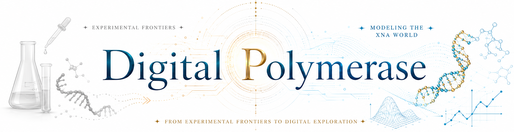

<p align="center">
  
</p>

# Digital Polymerase

**Digital Polymerase** is an early-stage dry-lab software project for exploring computational conversion and reconstruction between canonical nucleic acids (**DNA** and **RNA**) and xeno/synthetic nucleic acids (**XNA**) such as **HNA, ANA, FANA, TNA, GNA, CeNA**, and others.

The project focuses on **structure-guided nucleic acid transformation**, especially using **PDB structures as input and output**. Rather than treating conversion as a simple atom-replacement problem, Digital Polymerase develops template-guided, chain-aware, and polymer-aware approaches for rebuilding nucleic acid structures across different backbone chemistries.

All generated structures should be interpreted as **computational candidate models**, not experimentally validated molecules. They require downstream structural validation such as geometry inspection, stereochemical review, energy minimization, molecular dynamics simulation, force-field/topology assessment, and expert chemical evaluation.

---

## Vision

Digital Polymerase is part of the broader **XNA World Project**, a dry-lab framework for exploring alternative genetic polymers and their relevance to the functional thresholds of life.

Wet-lab xenobiology investigates whether XNA molecules can be synthesized, copied, evolved, and made functional. Digital Polymerase focuses on the complementary **in silico side**: building tools that help researchers model, transform, compare, and stress-test nucleic acid systems across natural and synthetic chemistries.

In this broader vision, Digital Polymerase serves as the **conversion and reconstruction engine**.

---

## Project Philosophy

Digital Polymerase does not assume that nucleic acid conversion is a one-step operation.

A conversion may occur at different levels:

1. **Symbolic conversion**  
   Rewriting a sequence or residue representation from one nucleic acid type to another.

2. **Topological conversion**  
   Reassigning residue identity, backbone atoms, linkage patterns, and polymer architecture.

3. **Geometric reconstruction**  
   Rebuilding a candidate 3D structure using structural templates, local alignment, chain-preserving transformations, or coordinate reconstruction.

4. **Physically refined modeling**  
   Evaluating and refining the candidate structure through molecular mechanics, energy minimization, molecular dynamics, and other validation workflows.

The current focus is on **Level 3: geometric candidate reconstruction**.

A key lesson from the early prototypes is:

> A converter is not successful just because it writes a PDB. It must preserve polymer logic, validate its own geometry, and report its limitations.

---

## Goals

- Convert nucleic acid structures between **DNA, RNA, and XNA types**
- Support **PDB-based structural transformation**
- Develop a modular framework for **polymer-aware parsing, alignment, rebuilding, validation, and export**
- Preserve sequence information while allowing backbone chemistry to change
- Distinguish **local residue geometry** from **whole-polymer chain continuity**
- Facilitate future modeling of **alternative nucleic acid worlds**
- Serve as a computational support layer for **xenobiology, synthetic biology, computational structural biology, and origins-of-life research**

---

## Current Working Prototype Families

Digital Polymerase currently has three working RNA → XNA candidate-generation families:

| Prototype | Conversion | Main method | Current status |
|---|---|---|---|
| `001B` | RNA → HNA | Full-template-guided short-mer reconstruction | Successful 8-mer candidate |
| `001C.1` | RNA → HNA | Chain-preserving scalable HNA-like reconstruction with base-attachment correction | Successful scaling to 111 nt |
| `002A.2` | RNA → ANA | Chain-preserving fragment-guided reconstruction | Successful candidate generation up to 111 nt |
| `003A` | RNA → FANA | Chain-preserving reconstruction with FANA C2′/F2′ local geometry | Successful candidate generation up to 111 nt |

These are **prototype candidate generators**, not stable production converters.

---

## Prototype 001B/001C.1: RNA → HNA

The HNA family began as the first RNA → XNA proof of concept, then evolved into a refactored and scalable prototype family.

### Prototype 001B — full-template HNA reconstruction

Prototype 001B is used when a full-length HNA template is available.

Example:

```text
RNA-8mer.pdb + 481d-HNA8nt.pdb → HNA-like 8-mer candidate
```

The method:

1. uses the HNA template as the backbone/scaffold donor
2. aligns RNA base atoms into the HNA local frame
3. transplants RNA bases onto the HNA scaffold
4. validates chain continuity and base attachment

### Prototype 001C.1 — scalable chain-preserving HNA reconstruction

Prototype 001C.1 extends HNA reconstruction to RNA inputs longer than the available HNA template.

Example benchmarked inputs:

```text
RNA-12mer
RNA-16mer
RNA-22mer
RNA-34mer
HH-type I ribozyme-derived 111-mer
```

The method:

1. preserves RNA chain-continuity atoms
2. inserts local HNA scaffold atoms such as `O4′`, `C6′`, `C1′`, and `C2′`
3. transforms RNA bases onto the new HNA-like local scaffold
4. corrects C1′→glycosidic-N distance using the selected HNA template
5. validates O3′→P, C1′→N, C1′→C6′, and C6′→O4′ distances

Current benchmark result:

```text
HNA-like candidate generation scales from 8 nt to 111 nt.
```

---

## Prototype 002A.2: RNA → ANA

The ANA prototype began as a residue-local fragment-guided converter using a 4-mer ANA template.

Initial ANA reconstruction showed a critical failure mode:

```text
low local RMSD ≠ valid polymer chain
```

Patch 002A.1 added explicit chain-continuity validation and revealed that residue-local conversion broke many O3′→P links.

Patch 002A.2 introduced a chain-preserving strategy:

```text
preserve chain continuity first
introduce ANA-like local geometry second
validate explicitly
```

Current status:

```text
RNA → ANA chain-preserving candidate generation works visually and computationally up to the 111-mer benchmark.
```

---

## Prototype 003A: RNA → FANA

Prototype 003A applies the chain-preserving design principle from the beginning.

For FANA, the converter:

1. preserves RNA polymer-chain atoms
2. removes RNA O2′
3. introduces FANA-like C2′ and F2′ local geometry from a FANA template
4. preserves RNA bases
5. validates O3′→P, P→O5′, C1′→C2′, C2′→C3′, and C2′→F2′ geometry

Current status:

```text
RNA → FANA candidate generation works from 8 nt to 111 nt, with C2′→F2′ distances around the expected template-derived range.
```

---

## Benchmarks

Digital Polymerase keeps both successful and failed benchmarks. Failure cases are intentionally preserved because they define the next algorithmic boundary.

| Benchmark | Focus | Result |
|---|---|---|
| `Benchmark 002` | HH ribozyme RNA → HNA early scaling failure | Productive failure; short-mer logic did not generalize directly |
| `Benchmark 003` | ANA fragment-guided scaling | Revealed chain-continuity failure, then led to 002A.2 chain-preserving ANA |
| `Benchmark 004` | FANA chain-preserving scaling | Successful candidate generation from 8 nt to 111 nt |
| `Benchmark 005` | HNA template regression | Successful HNA 8-mer full-template regression |
| `Benchmark 006` | HNA scaling | Successful HNA-like candidate generation from 8 nt to 111 nt using 001C.1 |

Recommended benchmark folders:

```text
benchmarks/
├── hh_ribozyme_8t5o/
├── ana_fragment_scaling/
├── fana_fragment_scaling/
├── hna_template_regression/
└── hna_scaling/
```

---

## Suggested Repository Structure

```text
digital-polymerase/
├── README.md
├── LICENSE
├── requirements.txt
├── assets/
│   └── digital_polymerase_banner__v2.png
│
├── src/
│   └── digital_polymerase/
│       ├── core/
│       │   └── README.md
│       ├── converters/
│       │   └── README.md
│       └── prototypes/
│           ├── rna_to_hna_template_guided.py
│           ├── rna_to_ana_fragment_guided.py
│           └── rna_to_fana_fragment_guided.py
│
├── docs/
│   ├── prompt_protocol.md
│   ├── prototype_001B_rna_to_hna_template_guided.md
│   ├── prototype_001C_rna_to_hna_chain_preserving.md
│   ├── prototype_002A_rna_to_ana_fragment_guided.md
│   └── prototype_003A_rna_to_fana_fragment_guided.md
│
├── examples/
│   └── rna_to_hna_8mer/
│
└── benchmarks/
    ├── hh_ribozyme_8t5o/
    ├── ana_fragment_scaling/
    ├── fana_fragment_scaling/
    ├── hna_template_regression/
    └── hna_scaling/
```

---

## Related Tools and Inspirations

Digital Polymerase is inspired by existing nucleic acid and XNA modeling tools, but it is not intended to duplicate them.

At present, there is no widely established one-click tool that takes an arbitrary DNA/RNA PDB structure and directly converts it into a chemically validated XNA PDB structure. Existing tools instead focus on related tasks such as building XNA duplexes, modeling nucleic acid analogs, analyzing or rebuilding nucleic acid structures, or preparing modified nucleotides for molecular dynamics.

Relevant inspirations include:

### Ducque

**Ducque** is an open-source XNA builder designed for constructing nucleic acid analog duplexes with customizable chemistry. It has been demonstrated in a molecular modeling pipeline for morpholino nucleic acid/RNA duplexes and is especially relevant to XNA-native structure generation [1].

Digital Polymerase is inspired by Ducque’s XNA-native philosophy, especially its focus on customizable nucleic acid analog chemistry.

### proto-Nucleic Acid Builder (pNAB)

**pNAB** is an open-source tool for modeling nucleic acid analogs with alternative backbones and nucleobases. It performs conformational searches to generate candidate structures and was developed to support exploration of XNAs and possible pre-RNA genetic polymers [2].

Digital Polymerase is inspired by pNAB’s general framework for exploring alternative nucleic acid architectures.

### modXNA

**modXNA** is a modular tool for deriving and building modified nucleotides for use with Amber force fields. It is especially relevant for molecular dynamics simulations of noncanonical or modified nucleic acid systems [3].

Digital Polymerase is not currently a force-field parameterization tool, but future workflows may benefit from compatibility with parameterization approaches such as modXNA.

### 3DNA / X3DNA-DSSR

**3DNA** provides tools for the analysis, reconstruction, and visualization of three-dimensional DNA and RNA structures from coordinate files [4]. **DSSR** extends this structural-analysis tradition by dissecting and annotating RNA tertiary structures, including canonical and noncanonical base pairs [5].

Digital Polymerase is inspired by the nucleic-acid structural analysis and rebuilding tradition represented by these tools, while extending the question toward XNA-aware reconstruction.

### NAB / AmberTools

**NAB** is a nucleic acid modeling language originally developed for building unusual nucleic acid structures using rigid-body transformations, distance geometry, and molecular mechanics refinement [6].

Digital Polymerase is inspired by this tradition of programmatic nucleic acid construction, but aims to focus specifically on template-guided and chain-aware NA→XNA reconstruction.

---

## Planned Features

### Core features

- Parse nucleic acid structures from **PDB**
- Detect and classify nucleic acid residue types
- Separate backbone atoms from base atoms
- Perform local coordinate alignment
- Validate polymer-chain continuity
- Validate local scaffold geometry
- Export reconstructed structures as **PDB**
- Generate Markdown reports describing method, validation, and limitations

### Canonical nucleic acid conversion

- DNA → RNA
- RNA → DNA

### Extended XNA conversion

- DNA/RNA → XNA
- XNA → DNA/RNA
- XNA → XNA

Candidate XNA targets include:

- HNA
- ANA
- FANA
- TNA
- GNA
- CeNA
- LNA
- PNA

### Structural rebuilding

- Template-guided nucleic acid reconstruction
- Chain-preserving reconstruction
- Fragment-guided reconstruction
- Segment-guided reconstruction
- Preservation of sequence order and approximate base arrangement
- Backbone/scaffold-template transplantation
- Local base alignment
- Candidate PDB generation

### Downstream compatibility

Future versions may support integration with:

- molecular dynamics workflows
- energy minimization pipelines
- force-field parameterization tools
- external nucleic acid/XNA modeling tools
- topology/connectivity generation

---

## Important Note

Digital Polymerase does **not** claim that a converted structure is automatically physically valid, chemically complete, or biologically functional.

A converted model should be interpreted as a **computationally generated candidate structure**, which may require:

- geometry refinement
- bond and angle validation
- stereochemical inspection
- energy minimization
- molecular dynamics simulation
- force-field and topology assessment
- expert chemical evaluation
- comparison with experimental XNA structures

---

## Scope

This repository is intended as a **dry-lab computational tool**, not as a replacement for experimental validation.

Its long-term purpose is to help researchers explore possible structural scenarios in which functional XNA molecules may exist, interact, or be compared with canonical nucleic acids.

Digital Polymerase is especially intended for exploratory work in:

- xenobiology
- synthetic biology
- computational structural biology
- nucleic acid engineering
- alternative genetic polymers
- origins-of-life and astrobiology-inspired molecular systems

---

## Development Roadmap

Near-term development priorities include:

1. Refactor shared parser, residue, alignment, validation, and report logic into `core/`
2. Standardize prototype CLI behavior and report format
3. Preserve prototype scripts under `prototypes/` until they pass stronger validation
4. Add topology/connectivity support, including possible `CONECT` output
5. Add stronger stereochemistry and clash validation
6. Expand RNA → XNA candidates beyond HNA, ANA, and FANA
7. Build CeNA, TNA, and GNA prototype families
8. Explore compatibility with minimization and force-field parameter workflows
9. Develop a generalized NA → XNA conversion framework

---

## Relationship to the XNA World Project

Digital Polymerase is envisioned as one component of the broader XNA World Project.

The XNA World Project aims to explore how alternative nucleic acid chemistries may approach life-relevant functional thresholds, including:

- information storage
- molecular recognition
- templated copying
- structural folding
- catalytic potential
- evolvability
- system integration

Digital Polymerase contributes to this vision by providing computational tools for structure conversion, reconstruction, and scenario modeling.

---

## Milestones

### 2026 — Short-oligomer and scalable RNA → XNA converter prototypes

The first development milestone is to create and validate prototype converters for nucleic acid-to-XNA candidate reconstruction using RNA input structures.

Initial achieved targets include:

- RNA → HNA full-template-guided reconstruction
- RNA → HNA scalable chain-preserving reconstruction
- RNA → ANA chain-preserving fragment-guided reconstruction
- RNA → FANA chain-preserving reconstruction
- Scaling tests from 8-mer inputs to an HH-type I ribozyme-derived 111-mer input
- Markdown reports with chain-continuity and local scaffold validation
- Visual inspection using PyMOL and Discovery Studio

The 2026 goal is not to claim full physical or biological validity, but to establish a working computational foundation for **nucleic-acid-to-XNA candidate reconstruction**.

---

## Current Status

This project is in early active development.

The current prototype families have demonstrated candidate-generation workflows for:

```text
RNA → HNA
RNA → ANA
RNA → FANA
```

These outputs are visually coherent and pass current internal geometry checks up to the 111-mer benchmark, but they remain **computational candidates**. The next major development stage is modularization, stronger chemical validation, topology/connectivity support, and extension to additional XNA chemistries.

---

## License

This project is released under the **MIT License**.

---

## Acknowledgment of AI-Assisted Development

This project uses AI-assisted coding and reasoning workflows during early prototyping, including iterative comparison between source and target nucleic acid structures, prototype generation, code review, benchmark interpretation, and documentation drafting.

All generated code and structural outputs should be critically reviewed, tested, and scientifically validated before use in research conclusions.

---

## Author

Developed by **Adhityo Wicaksono, Arli Aditya Parikesit**  
as part of an ongoing computational exploration of nucleic acid diversity, xenobiology, and the dry-lab side of the **XNA World Project**.

---

## References

[1] Rihon, J., Mattelaer, C.-A., Montalvão, R. W., Froeyen, M., Pinheiro, V. B., & Lescrinier, E. (2024). Structural insights into the morpholino nucleic acid/RNA duplex using the new XNA builder Ducque in a molecular modeling pipeline. *Nucleic Acids Research*, 52(6), 2836–2847. https://doi.org/10.1093/nar/gkae135

[2] Alenaizan, A., Barnett, J. L., Hud, N. V., Sherrill, C. D., & Petrov, A. S. (2021). The proto-Nucleic Acid Builder: a software tool for constructing nucleic acid analogs. *Nucleic Acids Research*, 49(1), 79–89. https://doi.org/10.1093/nar/gkaa1159

[3] Love, O., Galindo-Murillo, R., Roe, D. R., Dans, P. D., Cheatham, T. E. III, & Bergonzo, C. (2024). modXNA: A modular approach to parametrization of modified nucleic acids for use with Amber force fields. *Journal of Chemical Theory and Computation*, 20(21), 9354–9363. https://doi.org/10.1021/acs.jctc.4c01164

[4] Lu, X.-J., & Olson, W. K. (2003). 3DNA: a software package for the analysis, rebuilding and visualization of three-dimensional nucleic acid structures. *Nucleic Acids Research*, 31(17), 5108–5121. https://doi.org/10.1093/nar/gkg680

[5] Lu, X.-J., Bussemaker, H. J., & Olson, W. K. (2015). DSSR: an integrated software tool for dissecting the spatial structure of RNA. *Nucleic Acids Research*, 43(21), e142. https://doi.org/10.1093/nar/gkv716

[6] Macke, T. J., & Case, D. A. (1998). Modeling unusual nucleic acid structures. In N. B. Leontis & J. SantaLucia Jr. (Eds.), *Molecular Modeling of Nucleic Acids* (ACS Symposium Series, Vol. 682, pp. 379–393). American Chemical Society. https://doi.org/10.1021/bk-1998-0682.ch024
